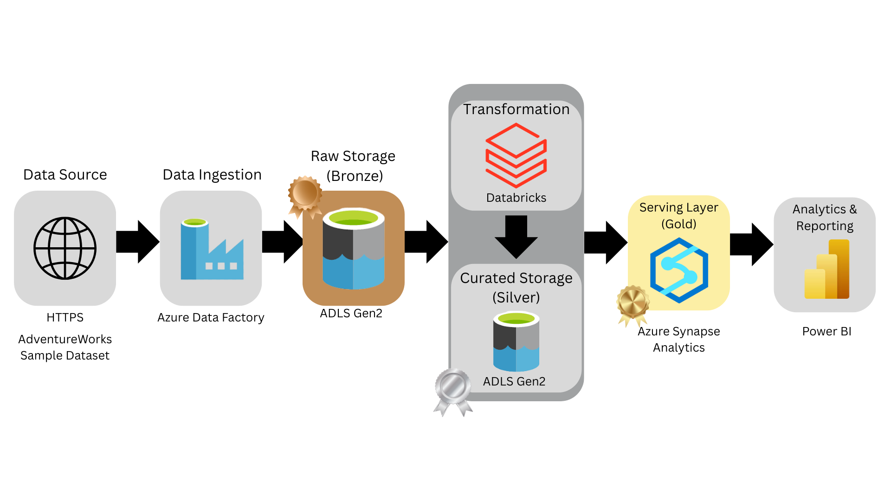

# Azure End-to-End Data Engineering Project

This project implements an end-to-end data pipeline on Azure:

- **Ingestion**: Azure Data Factory ingests data from an HTTP source into ADLS Gen2 (Raw/Bronze).
- **Storage**: Raw and transformed data are stored in Azure Data Lake Storage Gen2.
- **Transformation**: Databricks (or Spark) transforms raw data into curated (Silver) data.
- **Serving**: Azure Synapse Analytics exposes External Tables and Gold views on top of the lake.
- **Reporting**: Power BI connects to Synapse and builds a dashboard on the Gold layer.
- **Dataset**: The pipeline uses the **AdventureWorks** sample dataset as the business domain (sales, products, customers).

## Architecture



## Repository Structure

```text
sql/          # Synapse SQL scripts (schema, external tables, gold views)
adf/          # Azure Data Factory ARM templates and definitions
databricks/   # Databricks notebooks (optional)
powerbi/      # Power BI report and screenshots (optional)
docs/         # Architecture diagram and notes
